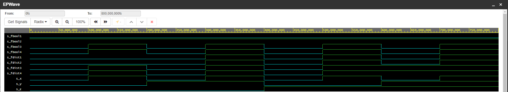

# Digital-electronics1

```vhdl
architecture dataflow of gates is
begin
    f_o  <= ((not_b_i) and a_i) or ((not c_i) and (not b_i));
    fand_o <= a_i and b_i;
    fxor_o <= a_i xor b_i;

end architecture dataflow;
```
| **c** | **b** |**a** | **f(c,b,a)** |
| :-: | :-: | :-: | :-: |
| 0 | 0 | 0 | 1 |
| 0 | 0 | 1 | 1 |
| 0 | 1 | 0 | 0 |
| 0 | 1 | 1 | 0 |
| 1 | 0 | 0 | 0 |
| 1 | 0 | 1 | 1 |
| 1 | 1 | 0 | 0 |
| 1 | 1 | 1 | 0 |


https://www.edaplayground.com/x/iTzv

# 1,2)

```vhdl
architecture dataflow of gates is
begin

    fbool1_o <= x_i and (not x_i);
    fbool2_o <= x_i or (not x_i);
    fbool3_o <= x_i or x_i or x_i;
    fbool4_o <= x_i and x_i and x_i;
    fdist1_o <= (x_i and y_i) or (x_i and z_i);
    fdist2_o <= x_i and (y_i or z_i);
    fdist3_o <= (x_i or y_i) and (x_i or z_i);
    fdist4_o <= x_i or (y_i and z_i);

end architecture dataflow;
```
https://www.edaplayground.com/x/PPaT


