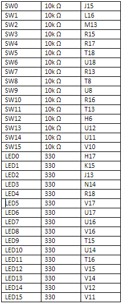

Úkol 1:



Úkol 2:
```vhdl
architecture Behavioral of mux_2bit_4to1 is
begin

f_o <= a_i when (sel_i = "00") else
       b_i when (sel_i = "01") else
       c_i when (sel_i = "10") else
       d_i;  


end architecture Behavioral;
```

```vhdl
    p_stimulus : process
    begin
        -- Report a note at the begining of stimulus process
        report "Stimulus process started" severity note;
         s_a   <= "00"; s_b <= "00"; s_c <= "00"; s_d <= "00";
         s_sel <= "00"; wait for 10 ns;
         
         s_a   <= "01";  wait for 10 ns;
         s_b   <= "01"; wait for 10 ns;
         
         s_sel <= "01"; wait for 10 ns;
         s_c   <= "00";  wait for 10 ns;
         s_d   <= "11"; wait for 10 ns;
         
         s_a   <= "00"; s_b <= "01"; s_c <= "11"; s_d <= "10";
         s_sel <= "10"; wait for 10 ns;
         
         s_a   <= "01"; s_b <= "00"; s_c <= "00"; s_d <= "00";
         s_sel <= "10"; wait for 10 ns;
         
         s_a   <= "00"; s_b <= "01"; s_c <= "11"; s_d <= "10";
         s_sel <= "11"; wait for 10 ns;
        -- Report a note at the end of stimulus process
        report "Stimulus process finished" severity note;
        wait;
    end process p_stimulus;
```

Úkol 3:
